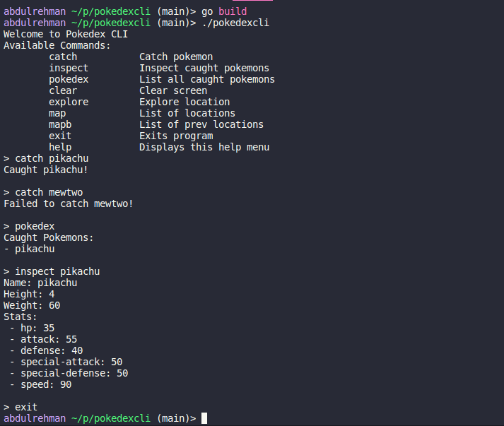

# Pokedex CLI
Another one of the tutorial-hell project from this [Youtube Video](https://www.youtube.com/watch?v=8yrmAGcCnKg)

## Installation
1. Install [Go](https://go.dev/).
2. Clone this repo
```bash
git clone https://github.com/abdul-rehman-d/pokedex-cli.git
```
3. Build the project
```bash
go build
```

## Usage
```bash
./pokedexcli
```

## Screenshots
